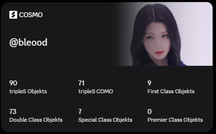

Add a widget to your Discord profile with your Cosmo Objekt statistics!

*Warning: Discord made it so you can't put widgets on your profile you don't own. You need to make your own bot to use this.*

## Requirements

- Python (3.13 or newer)
- `httpx`, `rich`, `orjson`

## Instructions

1. Set up the widget
   - This is out of scope for this README, but you can find good instructions here: https://chloecinders.com/blog/discord-widgets#how-to-make-discord-widgets
2. Ensure you have the correct label IDs
   - You will need the following keys:
     - `total_objekts` (tripleS objekt count)
     - `triples_como` (tripleS COMO balance)
     - `first_class_objekts` (First class objekts)
     - `double_class_objekts` (Double class objekts)
     - `special_class_objekts` (Special class objekts)
     - `premier_class_objekts` (Premier class objekts)
3. Copy the configuration template
   - `cp config_cosmo.json.templ config_cosmo.json`
   - This is where you add your Discord app ID, user ID, etc. Feel free to put as many users as you want!
   - Never commit `config_cosmo.json` itself once it has your real bot token in it - only the `.templ` version should go in the repo.
4. Run the script!
   - `python3 refresh_cosmo.py`

After you add the widget to your profile, it should now reload every X minutes (set in the config file).

## Issues

Do NOT open issues for problems with Discord. You will be blocked from opening issues. Issues are exclusively for problems with the script.

This scrapes apollo.cafe directly since there's no public API - if Apollo changes their site layout, the script may break until it's updated.

---

Made by [@bleood](https://github.com/bleood)
